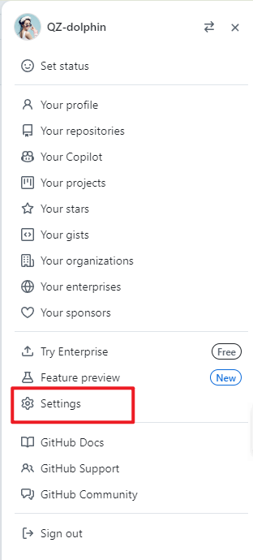
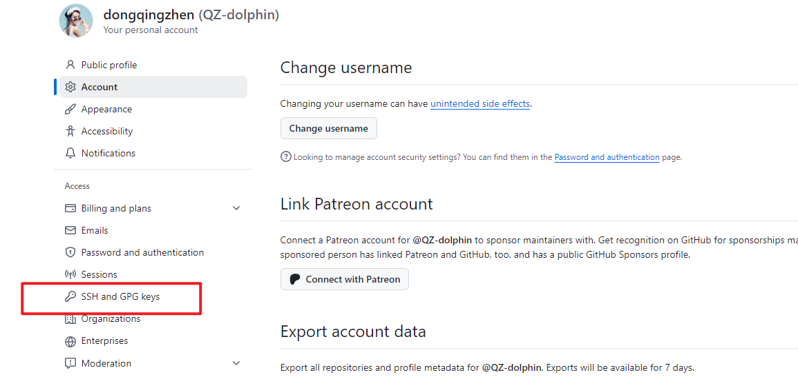
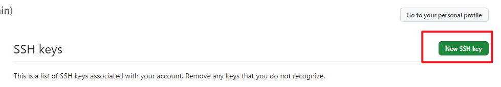
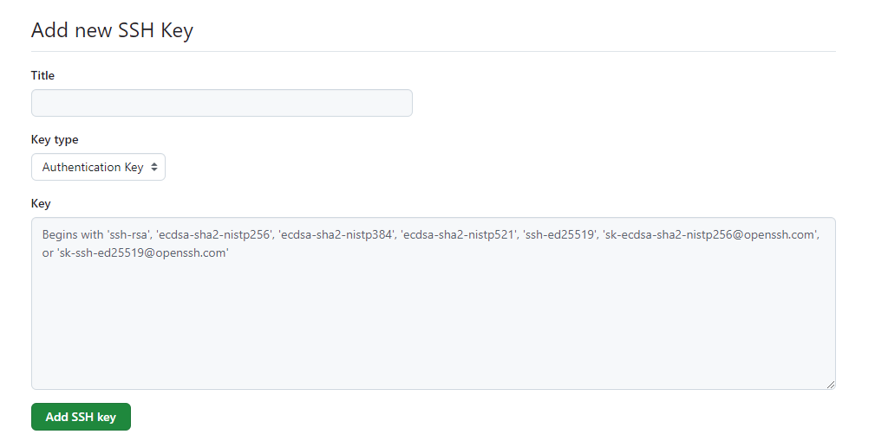
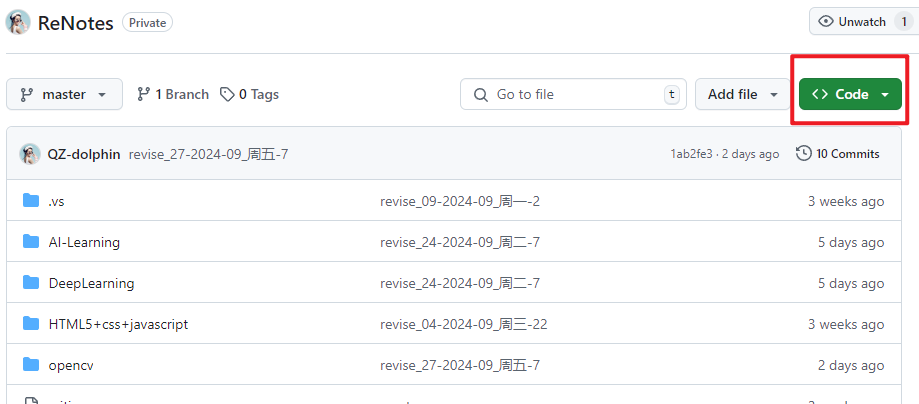
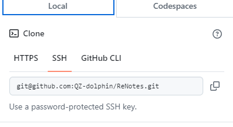

# Git 教程简单版
## 一、目标
远程 pull github中的该笔记至本地库，并实现同步。

## 二、步骤
### 1、下载软件
https://git=scm.com/downloads/win
需要用梯子下载
### 2、创建 ssh key
在⽤户主目录下，看看有没有`.ssh`目录，如果有，再看看这个目录下 有没有id_rsa和id_rsa.pub这两个⽂件，如果已经有了，可直接跳到下⼀步。如果没有，打开Shell（Windows下打开Git Bash），创建SSH Key：

```bash
ssh-keygen -t rsa -C "troyartum@outlook.com"
```
然后⼀路回⻋，使⽤默认值即可。

### 3、添加 ssh key

> （1）点击头像->点击`setting`



> （2）点击 `SSH and GPG keys`



> 点击`New SSH key`



> （3）填上任意Title，在Key⽂本框⾥粘贴id_rsa.pub⽂件的内容



### 4、初始化文件夹
打开要存放文件的文件夹，打开Git Bash，输入
```Bash
git config --global user.name "qingzhen_laptop"
git config --global user.email "troyartum@outlook.com"

git init
```

### 5、复制笔记ssh地址
> （1）选择对应项目，点击`code`



> （2）复制`ssh`



### 6、克隆笔记仓库
在要存放文件的文件夹，注意，应该是存放项目ReNotes文件夹的目录，打开Git Bash，输入
```Bash
git clone git@github.com:QZ-dolphin/ReNotes.git
```
会在该文件夹下保存项目ReNotes文件夹。
### 7、切换电脑时
先pull github中最新的文件，再编辑本地，再push。
```Bash
git pull

git push origin
```
然而，如果是已经git pull 后，ReNotes文件夹中自带了脚本`git_push.bat`，在ReNotes\路径下的终端（vscode终端亦可）输入
```Bash
.\git_push.bat
```
即可自动同步笔记。

## 三、常用操作
### 配置类
#### 查看配置
```sh
git config --list

REM 查看全局配置
git config --global user.name
git config --global user.email
```
…or create a new repository on the command line
```batch
echo "# DLearning" >> README.md
git init
git add README.md
git commit -m "first commit"
git branch -M main
git remote add origin git@github.com:QZ-dolphin/DLearning.git
git push -u origin main
```

…or push an existing repository from the command line
```sh
git remote add origin git@github.com:QZ-dolphin/DLearning.git
git branch -M main
git push -u origin main

# 移除文件不提交，在.gitignore中添加后，执行
git rm --cached .env.production
```